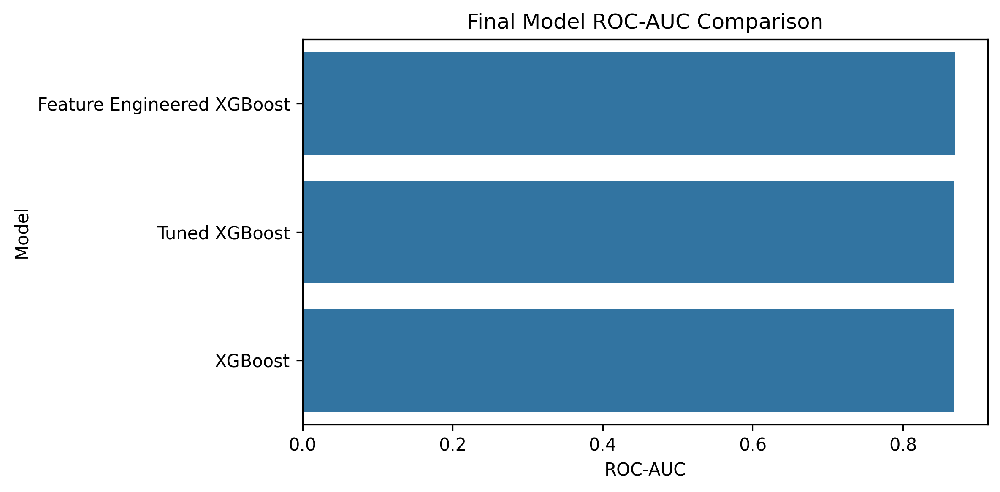
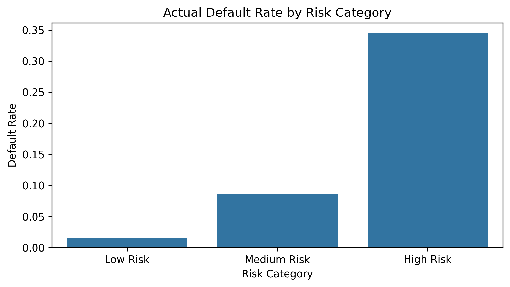
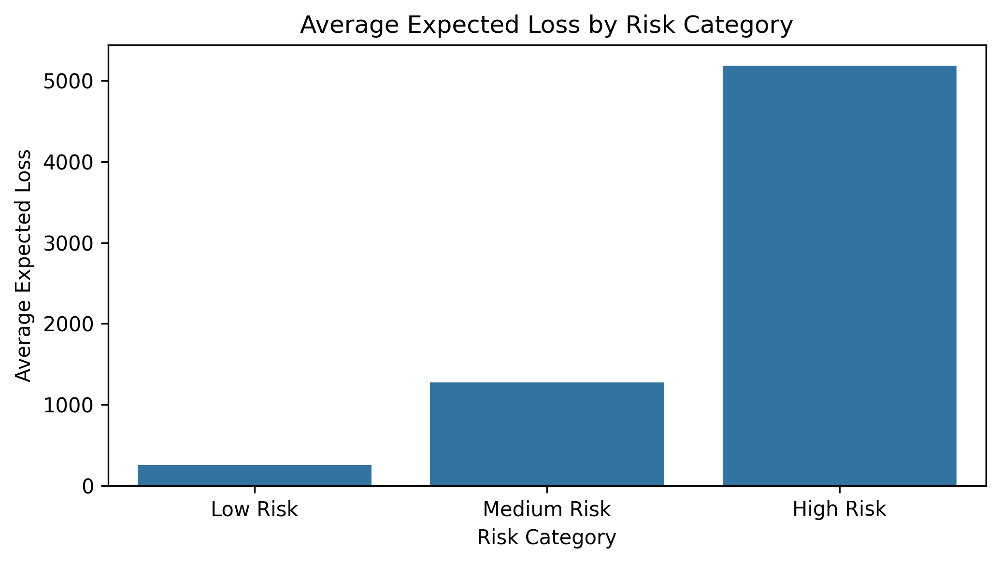
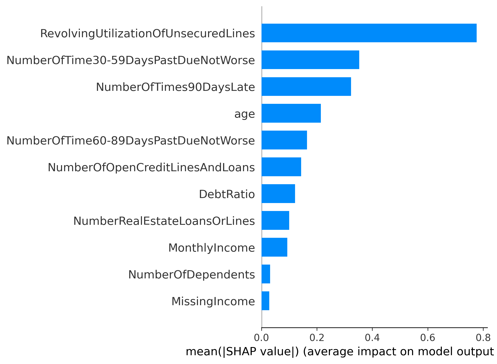
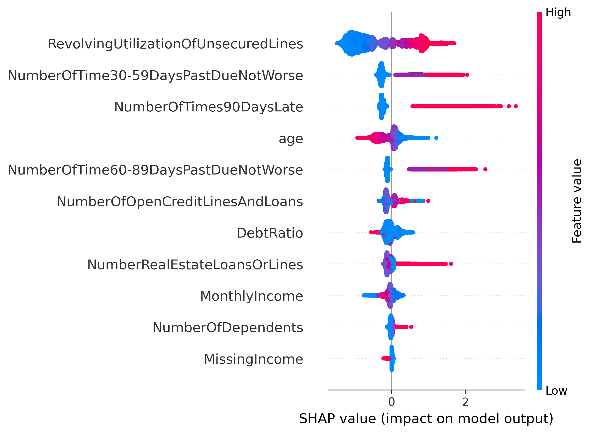
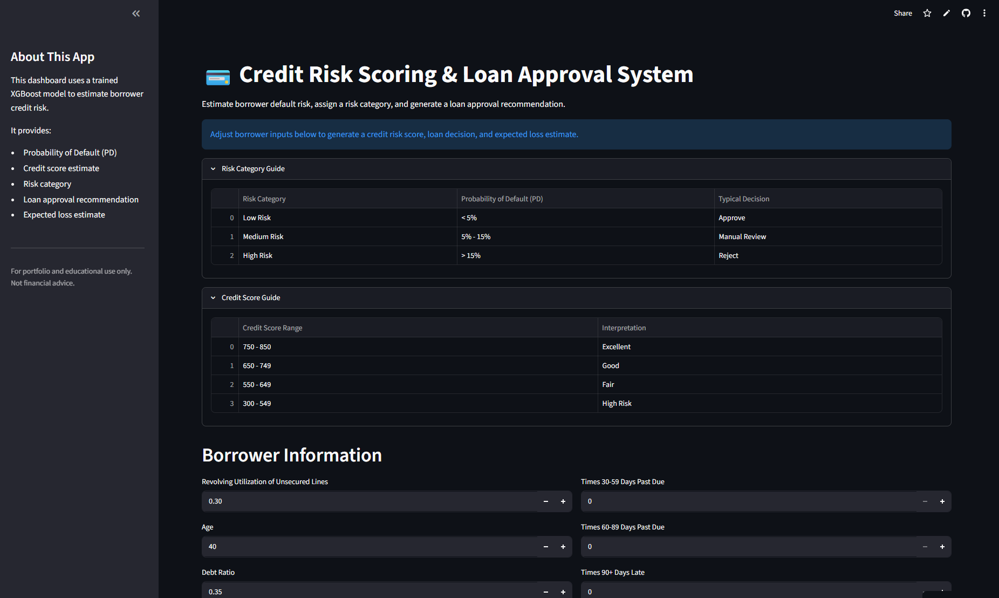
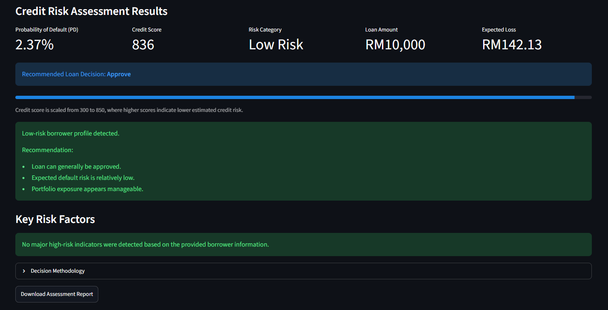
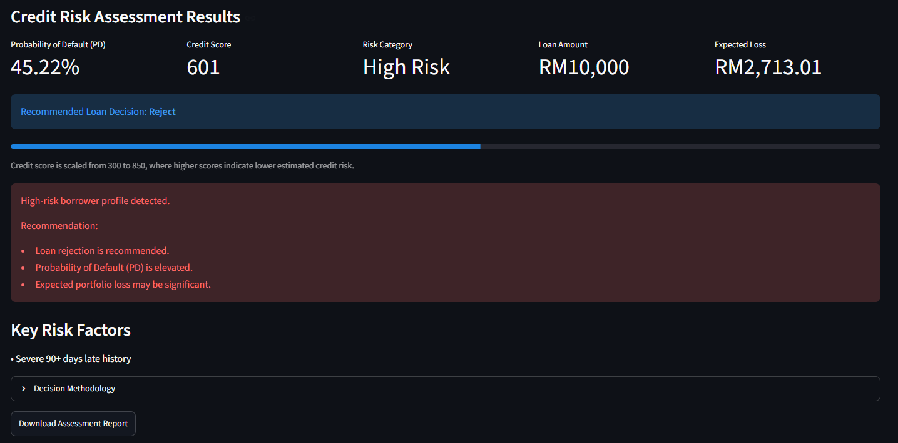

# 💳 Credit Risk Scoring & Loan Approval System

> ⭐ This project demonstrates an end-to-end credit risk scoring system, from model development and explainability to deployment through an interactive Streamlit application.

## 🌐 Live Demo

🔗 Streamlit Application: https://myrazd-credit-risk-scoring.streamlit.app/<br>
🔗 GitHub Repository: https://github.com/myrazd/credit-risk-scoring

---

## 📖 Project Overview

Financial institutions rely on accurate credit risk assessment to reduce default losses while maintaining profitable lending operations.<br>

This project develops an end-to-end machine learning solution that predicts borrower default risk, generates credit scores, segments customers into risk groups, estimates expected losses, and recommends loan approval decisions.<br>

The project combines predictive modeling, explainability, fairness evaluation, and deployment into a single production-style workflow.<br>

---

## 🎯 Business Problem

Traditional lending decisions can expose financial institutions to significant credit losses when high-risk borrowers are incorrectly approved.<br>

The objective of this project is to build a credit risk scoring system that can:<br>

- Predict the probability of borrower default.<br>
- Generate an interpretable credit score.<br>
- Segment borrowers into risk categories.<br>
- Recommend loan approval actions.<br>
- Estimate expected financial losses.<br>
- Improve lending decision consistency.<br>

---

## 📊 Dataset

**Dataset:** Give Me Some Credit (Kaggle)<br>

The dataset contains borrower financial information and historical repayment behaviour used to predict serious delinquency within the next two years.<br>

### Features

- Revolving Utilization of Unsecured Lines<br>
- Age<br>
- Debt Ratio<br>
- Monthly Income<br>
- Open Credit Lines and Loans<br>
- Delinquency History Variables<br>
- Real Estate Loans<br>
- Number of Dependents<br>

### Target Variable

- SeriousDlqin2yrs (Loan Default Indicator)<br>

### Dataset Size

- 150,000 records<br>
- 11 original features<br>
- Additional engineered risk features<br>

---

## 🏗️ Project Architecture


The system follows a complete machine learning deployment workflow:<br>

- User Input<br>
- Streamlit Dashboard<br>
- Feature Engineering Layer<br>
- Trained XGBoost Model<br>
- Prediction Engine<br>
- Credit Risk Outputs<br>

Outputs include:<br>

- Probability of Default (PD)<br>
- Credit Score<br>
- Risk Category<br>
- Loan Decision Recommendation<br>
- Expected Loss Estimation<br>

---

## 🚀 Key Features

- Loan default prediction using XGBoost.<br>
- Credit scoring system.<br>
- Risk segmentation framework.<br>
- Loan approval recommendation engine.<br>
- Expected loss estimation.<br>
- Feature engineering pipeline.<br>
- Hyperparameter tuning.<br>
- Threshold optimization.<br>
- SHAP explainability analysis.<br>
- Fairness evaluation across age groups.<br>
- Interactive Streamlit dashboard.<br>
- Downloadable credit risk assessment reports.<br>

---

## 🤖 Model Development Process

### 1. Exploratory Data Analysis

- Data quality assessment.<br>
- Missing value analysis.<br>
- Target distribution analysis.<br>
- Risk factor exploration.<br>

### 2. Baseline Models

The following baseline models were evaluated:<br>

- Logistic Regression<br>
- Random Forest<br>
- XGBoost<br>
- LightGBM<br>

### 3. Advanced Modelling

The project incorporates:<br>

- Hyperparameter tuning.<br>
- Feature engineering.<br>
- Threshold optimization.<br>

### 4. Feature Engineering

Additional credit risk indicators were created:<br>

- TotalDelinquencies<br>
- HasDelinquencyHistory<br>
- HighUtilizationFlag<br>
- DebtToIncomeProxy<br>
- HasRealEstateLoan<br>
- MissingIncome Indicator<br>

---

## 📈 Model Performance

The final production model is a **Feature Engineered XGBoost Classifier**.<br>

| Model | ROC-AUC |
|---------|---------|
| Logistic Regression | 0.854 |
| Random Forest | 0.839 |
| XGBoost | 0.868 |
| LightGBM | 0.868 |
| Tuned XGBoost | 0.869 |
| Feature Engineered XGBoost | 0.869 |



### Final Model Highlights

- ROC-AUC: 0.869<br>
- Improved discrimination capability through feature engineering.<br>
- Strong balance between predictive performance and interpretability.<br>
- Suitable for deployment in a credit risk assessment workflow.<br>

---

## 🎯 Credit Scoring & Risk Segmentation

Borrowers are assigned a probability of default and categorized into risk groups.<br>

### Risk Categories

| Risk Category | Probability of Default | Typical Decision |
|--------------|-----------------------|------------------|
| Low Risk | < 5% | Approve |
| Medium Risk | 5% - 15% | Manual Review |
| High Risk | > 15% | Reject |

### Risk Segmentation Results



The risk segmentation framework successfully separates borrowers into groups with significantly different observed default rates.<br>

---

## 💰 Expected Loss Estimation

Expected loss is calculated using:<br>

**Expected Loss = Probability of Default × Loan Amount × Loss Given Default (LGD)**<br>

This allows lenders to estimate potential portfolio losses and improve risk management decisions.<br>



Key benefits include:<br>

- Portfolio monitoring.<br>
- Capital allocation support.<br>
- Risk-adjusted lending decisions.<br>
- Loss forecasting.<br>

---

## 🔍 Explainability & Fairness Evaluation

### SHAP Explainability

SHAP was used to understand the drivers behind model predictions.<br>

The analysis identifies the most influential borrower characteristics affecting default risk.<br>

#### Global Feature Importance



#### SHAP Beeswarm Analysis



Insights include:<br>

- Delinquency history strongly increases default risk.<br>
- High credit utilization increases borrower risk.<br>
- Income and age influence probability estimates.<br>
- Model predictions remain transparent and interpretable.<br>

### Fairness Evaluation

Fairness analysis was performed across age groups.<br>

The evaluation compared:<br>

- Actual default rates.<br>
- Predicted probabilities.<br>
- Loan decision distributions.<br>

This helps identify potential disparities and supports responsible AI practices.<br>

---

## 🖥️ Dashboard Preview

### Dashboard Home



### Low-Risk Borrower Example



### High-Risk Borrower Example



### Dashboard Capabilities

- Borrower risk assessment.<br>
- Probability of Default estimation.<br>
- Credit score generation.<br>
- Risk categorization.<br>
- Loan approval recommendation.<br>
- Expected loss estimation.<br>
- Downloadable assessment reports.<br>

---

## 📂 Repository Structure

```text
credit-risk-scoring/
│
├── app/
│   └── app.py
│
├── models/
│   └── credit_risk_model.pkl
│
├── notebooks/
│   ├── 01_data_preparation.ipynb
│   ├── ...
│   └── 10_final_model_selection.ipynb
│
├── images/
│   ├── architecture_diagram.png
│   ├── dashboard_home.png
│   ├── dashboard_low_risk.png
│   ├── dashboard_high_risk.png
│   ├── final_model_comparison.png
│   ├── shap_feature_importance.png
│   ├── shap_beeswarm.png
│   ├── default_rate_by_risk_category.png
│   └── expected_loss_by_risk_category.png
│
├── requirements.txt
├── LICENSE
├── .gitignore
└── README.md
```

---

## 🛠️ Technologies Used

- Python<br>
- Pandas<br>
- NumPy<br>
- Scikit-learn<br>
- XGBoost<br>
- LightGBM<br>
- SHAP<br>
- Matplotlib<br>
- Seaborn<br>
- Streamlit<br>
- Joblib<br>

---

## 🔮 Future Improvements

- Real-time credit bureau integration.<br>
- Alternative data source incorporation.<br>
- Dynamic LGD estimation.<br>
- Individual SHAP explanations within the dashboard.<br>
- Portfolio monitoring dashboard.<br>
- Automated model retraining pipeline.<br>
- Drift monitoring and model governance framework.<br>
